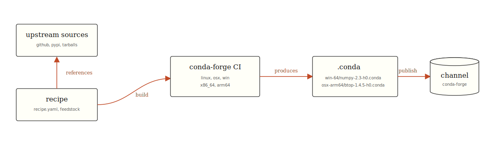
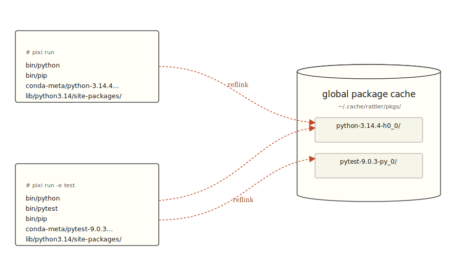
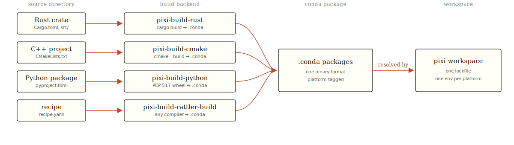

---
# Tufte-inspired theme — extracted to ./slidev-theme-tufte
theme: ./slidev-theme-tufte
title: Introducing Pixi
info: |
  ## Pixi & the Rust toolchain underneath
  Tim de Jager · prefix.dev
  Rust Meetup @ Jetbrains
class: text-center
drawings:
  persist: false
transition: slide-left
comark: true
duration: 35min
highlighter: shiki
---

<div class="relative mx-auto w-64 mb-4">
  
</div>


# Introducing Pixi

## Package Management, conda, and Rust 

<div class="mt-28">
Tim de Jager at 
</div>


---

# Who am I?


<div class="absolute right-12 bottom-24 w-72 h-44">
  
  
  
  <RiveAnimation v-click="7" src="/paxton_animation.riv" class="absolute inset-0 w-full h-full" />
</div>

<v-clicks depth="2">

- Tim de Jager [github](https://github.com/tdejager)
- Developer at 
- Used to work at:
  - Abbey Games (making games) with C++
  - Smart Robotics (making robots) with C++ and Python
  - .. Prefix.dev Rust and Package Managers

</v-clicks>


---
layout: center
---

# Take Away
<v-clicks>

- There is more than cargo,
- Working on package management is fun,
- ... pixi is kinda cool (hopefully)

</v-clicks>

---

# Why do I think its fun?

<v-clicks>

- Working on package managers is a great enabler
- Both algorithmic and more engineering problems
- People are generally quite grateful
- Active discord around ~250 members

</v-clicks>

---

# So what is Pixi?!


### Open Source on Github: https://github.com/prefix-dev/pixi
<br />
<v-clicks>

- Built on top of conda and conda-forge
- *Global* and *Local* environments
- `pixi.toml` as its main manifest with a lock file: `pixi.lock`.
- Supports *binary* and *source* dependencies.
- Especially useful in project combining multiple programming languages
  - Robotics
  - Data Science
  - etc.

</v-clicks>

<div v-click="6">

## I'll explain more of this in depth

</div>

---

# Philosophy of Pixi

<v-clicks>

- Pixi values:
  - Fast.
  - User Friendly.
  - Isolated Environments.
  - Single tool.
  - Fun.
- First class windows support
- `pixi run start` should be all you need

</v-clicks>


<!--
Pain-point opener. Concrete: we built robots, the deploy story was a mess.
-->

---
layout: two-cols
---

# Who's using `pixi`?

### Some repositories on GitHub with a `pixi.toml`

<div class="users-grid" :class="`clicks-${Math.min($clicks, 6)}`">

| stars | repository | how they use it |
|------:|:-----------|:-----------|
| **73k** | [python/cpython](https://github.com/python/cpython/tree/main/Tools/pixi-packages) | Build Environment for compiling CPython |
| **32k** | [numpy/numpy](https://github.com/numpy/numpy) | Dev environment for Contributors |
| **31k** | [FreeCAD/FreeCAD](https://github.com/FreeCAD/FreeCAD) | 5-platform C++/Python build & task runner |
| **26k** | [modular/modular](https://github.com/modular/modular) | recommended way to install MAX & Mojo |
| **5.4k** | [ros2/ros2](https://github.com/ros2/ros2) | windows installation, partial linux |
| **3.2k** | [NVIDIA/cuda-python](https://github.com/NVIDIA/cuda-python) | monorepo runner with CUDA 12 / 13 envs |

</div>

<style scoped>
.users-grid table {
  margin-top: 0.6rem;
  font-size: 0.95rem;
}
.users-grid th { font-weight: 400; font-style: italic; }
/* Each tbody row stays in the layout but starts muted, then brightens
 * cumulatively as its matching logo appears (clicks 1–5). */
.users-grid tbody tr {
  color: var(--tufte-muted);
  opacity: 0.4;
  transition: opacity 250ms ease, color 250ms ease;
}
.users-grid tbody tr a { color: inherit; }
.users-grid.clicks-1 tbody tr:nth-child(-n+1),
.users-grid.clicks-2 tbody tr:nth-child(-n+2),
.users-grid.clicks-3 tbody tr:nth-child(-n+3),
.users-grid.clicks-4 tbody tr:nth-child(-n+4),
.users-grid.clicks-5 tbody tr:nth-child(-n+5),
.users-grid.clicks-6 tbody tr:nth-child(-n+6) {
  color: var(--tufte-text);
  opacity: 1;
}
.logo-cloud {
  position: relative;
  width: 100%;
  height: 100%;
}
.logo-cloud img {
  position: absolute;
  object-fit: contain;
  filter: drop-shadow(0 2px 6px rgba(0, 0, 0, 0.12));
}
.logo-cloud .l-python  { top: 4%;  left: 18%; width: 28%; transform: rotate(-6deg); }
.logo-cloud .l-numpy   { top: 10%; right: 4%; width: 34%; transform: rotate(4deg); }
.logo-cloud .l-freecad { top: 36%; left: 4%;  width: 26%; transform: rotate(8deg); }
.logo-cloud .l-modular { top: 40%; right: 18%; width: 20%; transform: rotate(-3deg); }
.logo-cloud .l-nvidia  { bottom: 18%; left: 26%; width: 32%; transform: rotate(2deg); }
.logo-cloud .l-ros2    { bottom: 4%;  right: 6%; width: 32%; transform: rotate(-4deg); }
</style>

::right::

<div class="logo-cloud">
  
  
  
  
  
  
</div>

<!--
Counts pulled from a github code-search for `filename:pixi.toml`,
deduped to ~500 repos, then queried via GraphQL for stargazerCount and
sorted. Skipped prefix-dev/pixi itself and pixi-adjacent tooling.
-->

---

# So what is the conda ecosystem?!


### A cross-platform, cross-language package ecosystem

<br />

<v-clicks>

- Ships C, C++, Rust, Fortran, R, Java, ... whole native stacks
- Packages live on **channels**, basically indexes
- Isolated environments similar to `.venv`
- Origins in scientific computing now used in a bunch of places.

</v-clicks>

<!--
Frame conda as a generic native-package system. The talk's earlier
"this could be bigger" beat lands here. Drop `/conda.png` in public/.
-->

---

# So what is conda-forge?!


<div v-click="5" class="absolute right-0 top-72 w-164">

<div v-click="6" class="prefix-stamp">
  
</div>
</div>

<style scoped>
.prefix-stamp {
  position: absolute;
  top: 0%;
  right: 2%;
  transform: rotate(14deg);
  padding: 0.6rem;
  border: 3px solid black;
  border-radius: 22%;
  background: rgba(255, 255, 255, 1);
  pointer-events: none;
}
.prefix-stamp img {
  width: 5rem;
  height: 5rem;
  display: block;
}
</style>

### The community channel that powers most of the ecosystem

<br />

<v-clicks>

- Community-maintained channel ~32,000 packages
- One **recipe** (feedstock) per package, one CI per recipe
- Curated packages, need to get through a review first.
- Differs from `pypi`, `crates.io` etc. No developer machine publishing

</v-clicks>

---

# How conda-forge ships a package

<div class="cf-stage cf-ships-slide relative mt-6">



<RecipeCard v-click="1" side="left" side-offset="30%" top="4%" width="60%" font-size="0.7rem">

```yaml
# recipe.yaml
package:
  name: btop
  version: "1.4.5"

source:
  url: https://github.com/aristocratos/btop/archive/v${{ version }}.tar.gz
  sha256: 4a4d…

build:
  number: 0
  script: make && make install PREFIX=$PREFIX

requirements:
  build:
    - ${{ compiler('cxx') }}
    - make
  host:
    - libcxx
```

</RecipeCard>

</div>

<style>
.slidev-layout:has(.cf-ships-slide) {
  overflow: visible !important;
}
</style>

<!--
sources + recipe → CI → binary packages → channel.
Say it in plain English while the diagram does the lifting.
-->

---
layout: two-cols
---

# A `pixi.toml`: basics

<br/>

<v-clicks at="1">

1. *`pixi`*` add python`
2. *`pixi`*` add --feature test pytest`
3. *`pixi`*` project environment add test --feature test`
4. *`pixi`*` task add greet '...'`
5. *`pixi`*` run greet` 
6. *`pixi`*` run -e test pytest`

</v-clicks>

<!--
One slide, six clicks. Each click runs a real pixi command and the
manifest on the right morphs to match. The seventh click swaps the
manifest for the file tree showing the two isolated environments pixi
materialised on disk.
-->

::right::

<div v-click.hide="7">

````md magic-move {at:1, lines: true}
```toml
[workspace]
channels = ["conda-forge"]
name = "demo"
platforms = ["osx-arm64"]
version = "0.1.0"

[tasks]

[dependencies]
```
```toml
[workspace]
channels = ["conda-forge"]
name = "demo"
platforms = ["osx-arm64"]
version = "0.1.0"

[tasks]

[dependencies]
python = ">=3.14.4,<3.15"
```
```toml
[workspace]
channels = ["conda-forge"]
name = "demo"
platforms = ["osx-arm64"]
version = "0.1.0"

[tasks]

[dependencies]
python = ">=3.14.4,<3.15"

[feature.test.dependencies]
pytest = "*"
```
```toml
[workspace]
channels = ["conda-forge"]
name = "demo"
platforms = ["osx-arm64"]
version = "0.1.0"

[tasks]

[dependencies]
python = ">=3.14.4,<3.15"

[feature.test.dependencies]
pytest = "*"

[environments]
test = ["test"]
```
```toml
[workspace]
channels = ["conda-forge"]
name = "demo"
platforms = ["osx-arm64"]
version = "0.1.0"

[tasks]
greet = "python -c 'print(\"hello, meetup\")'"

[dependencies]
python = ">=3.14.4,<3.15"

[feature.test.dependencies]
pytest = "*"

[environments]
test = ["test"]
```
```bash
$ pixi run greet
hello, meetup
```
```bash
$ pixi run -e test pytest --version
pytest 9.0.3
```
````

</div>

<div class="env-stack">

<div v-click="[7, 8]" class="env-layer">

<FileTree
  rootLabel=".pixi/envs/"
  :tree="[
    { name: 'default', type: 'dir', comment: '`pixi run`', children: [
      { name: 'bin', type: 'dir', children: [
        { name: 'python', type: 'file' },
        { name: 'pip', type: 'file' },
      ]},
      { name: 'conda-meta', type: 'dir', children: [
        { name: 'python-3.14.4-h0_0.json', type: 'file' },
      ]},
      { name: 'lib/python3.14/site-packages/', type: 'dir' },
      { name: 'include/', type: 'dir' },
      { name: 'share/', type: 'dir' },
    ]},
    { name: 'test', type: 'dir', comment: '`pixi run -e test`', children: [
      { name: 'bin', type: 'dir', children: [
        { name: 'python', type: 'file' },
        { name: 'pytest', type: 'file' },
        { name: 'pip', type: 'file' },
      ]},
      { name: 'conda-meta', type: 'dir', children: [
        { name: 'python-3.14.4-h0_0.json', type: 'file' },
        { name: 'pytest-9.0.3-py_0.json', type: 'file' },
      ]},
      { name: 'lib/python3.14/site-packages/', type: 'dir', comment: 'pytest, _pytest, …' },
      { name: 'include/', type: 'dir' },
      { name: 'share/', type: 'dir' },
    ]},
  ]"
/>

</div>

<div v-click="8" class="env-layer">



</div>

</div>

<style scoped>
.env-stack {
  position: relative;
}
.env-layer {
  position: absolute;
  inset: 0;
}
</style>


<style>
/* Disable the theme's slide-scoped overflow scroll for this one slide so
 * the rotated recipe card can extend past the SVG without being clipped. */
.slidev-layout {
  overflow: visible !important;
}
</style>


---
layout: center
<!--class: text-center-->
---

# Some more demo's

---
layout: two-cols
---

# Demo: Global installations (`btop`)

<v-clicks at="1">

- One manifest, one isolated env per tool
- `pixi global install btop`, get its own env
- Trampoline in `~/.pixi/bin` (on `$PATH`)

</v-clicks>

<br/>

<div v-click="1">

```toml {lines: true}
# ~/.pixi/manifests/pixi-global.toml
# .. other things
[envs.btop]
channels = ["conda-forge"]
dependencies = { btop = "*" }
exposed = { btop = "btop" }
```

</div>

::right::

<div v-click="3">

<FileTree
  rootLabel="~/.pixi/"
  :tree="[
    { name: 'bin', type: 'dir', comment: 'everything exposed sits here', children: [
      { name: 'btop', type: 'link'},
      { name: 'eza', type: 'link' },
      { name: 'jj', type: 'link' },
      { name: '…', type: 'link' },
    ]},
    { name: 'manifests', type: 'dir', children: [
      { name: 'pixi-global.toml', type: 'file', comment: 'contains your global env' },
    ]},
    { name: 'envs', type: 'dir', children: [
      { name: 'btop', type: 'dir', comment: 'isolated conda env', children: [
        { name: 'bin/btop', type: 'file' },
        { name: 'conda-meta', type: 'dir', children: [
          { name: 'btop-1.4.5-h49c215f_0.json', type: 'file' },
          { name: 'libcxx-22.1.3-h55c6f16_0.json', type: 'file' },
        ]},
        { name: 'lib/', type: 'dir' },
        { name: 'share/btop/themes/', type: 'dir' },
      ]},
      { name: 'eza', type: 'dir' },
      { name: 'jj', type: 'dir' },
    ]},
  ]"
/>

</div>

---

# Demo: `Pixi` as a Polyglot

<v-clicks>

- conda-forge has: C++, Rust, R, Fortran etc. compilers
- Normally conda packages are binary.
- We have `pixi build`: *source directory* into a conda package
- **backend** per language

</v-clicks>

<div v-click class="mt-4">

</div>

<!--
Source → conda package, language-specific backend, one lock.
Don't read the bullets; let them land. Pivot straight to the demo.
-->


---

# `Pixi` with Inko 


<v-clicks>

- Try pixi and 
- Put inko to conda-forge: https://github.com/conda-forge/inko-feedstock
- Allows you to manage Inko compiler with Pixi

</v-clicks>


<RecipeCard v-click="4" side="right" class="inko-recipe">

```yaml
# inko-feedstock recipe.yaml
context:
  version: "0.20.0"

package:
  name: inko
  version: ${{ version }}

source:
  url: https://github.com/inko-lang/inko/archive/refs/tags/v${{ version }}.tar.gz
  sha256: 19cef883…

build:
  number: 0
  skip: win
  script:
    interpreter: nu
    content: |
      cargo auditable build --release --locked
      cp $"target/release/inko" $"($env.PREFIX)/bin/inko"

requirements:
  build:
    - ${{ compiler('c') }}
    - ${{ compiler('rust') }}
    - cargo-auditable
    - nushell
  host:
    - llvmdev 18.1.*
    - zlib
    - libxml2-devel
    - libffi
```

</RecipeCard>

<style>
.slidev-layout:has(.inko-recipe) {
  overflow: visible !important;
}
</style>

---

# How did we get here?

---
src: ./pages/converting-to-rust.md
---

---
layout: center
class: text-center
---

# Thanks For Listening
### Feel Free to ask me Anything

<div class="grid mt-10 grid-cols-2 gap-x-8 gap-y-6 my-6 justify-items-center">
  <a href="https://github.com/prefix-dev/pixi"></a>
  <a href="https://github.com/conda/rattler"></a>
  <a href="https://github.com/prefix-dev/rattler-build"></a>
  <a href="https://github.com/prefix-dev/resolvo"></a>
</div>
